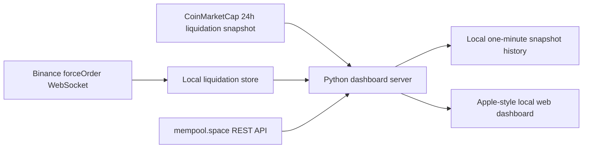

# Bitcoin Liquidation Pulse


Bitcoin Liquidation Pulse is a local market intelligence dashboard for BTC traders. It combines 24-hour long/short liquidation pressure, live BTCUSDT force-order events, and Bitcoin mempool activity into a polished Apple-inspired dark interface.

## Highlights

- No API key required for the default data path.
- Pulls a 24h BTC liquidation snapshot from CoinMarketCap public pages.
- Listens to Binance USD-M Futures `BTCUSDT` force-order liquidation events and tracks them separately from the 24h snapshot.
- Tracks Bitcoin fee pressure, mempool blocks, and recent large transactions via mempool.space.
- Shows source health and data freshness for CoinMarketCap, Binance, and mempool.space.
- Stores lightweight one-minute dashboard snapshots under `data/` for future trend views.
- Auto-detects the macOS HTTP proxy, useful when Binance needs a local proxy.
- Serves a fast local GUI with Chart.js visualizations and smooth transitions.
- Includes focused unit tests for liquidation aggregation, on-chain normalization, proxy parsing, and HTTP server behavior.

## Preview

The app runs as a local dashboard:

```text
http://127.0.0.1:8765
```

Core widgets include:

- 24h long vs. short liquidation totals.
- Source-aware liquidation totals that avoid default double counting.
- Hourly liquidation histogram for locally collected live events, with a CMC fallback before live events arrive.
- Long/short share chart.
- Bitcoin fee ladder and mempool block pressure.
- Recent large on-chain transactions.
- Data-source health and CMC/Binance split totals.

## Architecture



## Data Semantics

The dashboard uses the CoinMarketCap BTC 24h liquidation snapshot as the headline 24h market view when it is available. Binance force-order events are collected locally and shown as a separate live stream. The API exposes an experimental combined value for comparison, but the UI does not use it as the default headline because it may double count activity already included in the CoinMarketCap snapshot.

## Quick Start

```bash
cd /Users/a0000/bitcoin-liquidation-pulse
python3 -m venv .venv
source .venv/bin/activate
pip install -r requirements.txt
python app.py
```

Then open `http://127.0.0.1:8765`.

To run it in the background:

```bash
python run_dashboard.py
```

## VS Code Workflow

This project is configured for VS Code:

- `Run and Debug` includes `Bitcoin Liquidation Pulse`.
- Tasks include `Run Bitcoin Liquidation Pulse` and `Test Bitcoin Liquidation Pulse`.
- The integrated terminal automatically works with the project virtual environment when opened from this folder.

## Proxy Behavior

The app detects macOS system proxy settings automatically. If your local proxy is enabled at `127.0.0.1:7890`, requests and WebSocket connections use it without additional configuration.

## Validation

```bash
python -m unittest discover -s tests
ruff check .
python -m compileall liquidation_pulse app.py run_dashboard.py
```

## Portfolio Notes

This project demonstrates practical Python engineering for trading tools:

- Real-time data ingestion with WebSocket resilience.
- Public-data fallback design without paid API dependencies.
- Local dashboard architecture with a small Python HTTP server.
- Testable data normalization and aggregation layers.
- User-focused tooling, proxy handling, and VS Code developer experience.

## License

MIT License. See [LICENSE](LICENSE).
